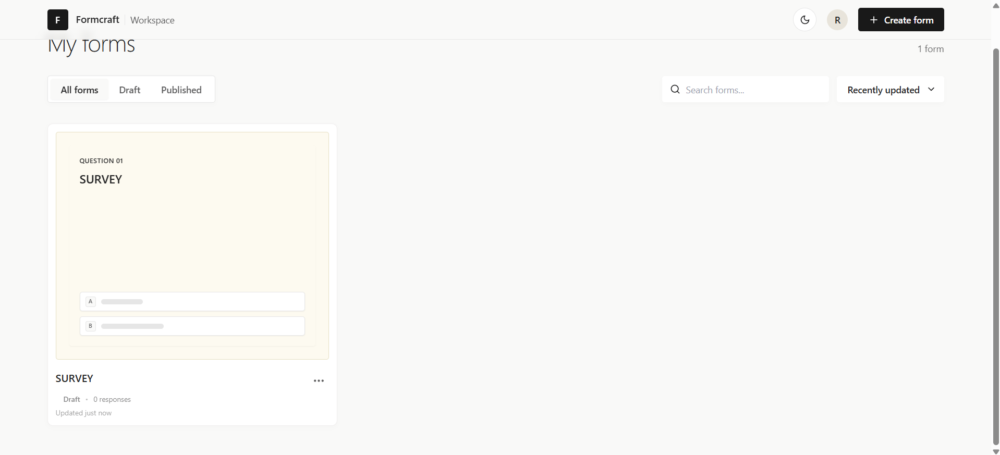
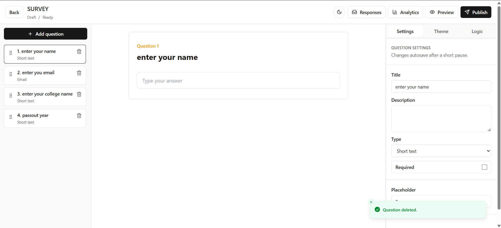
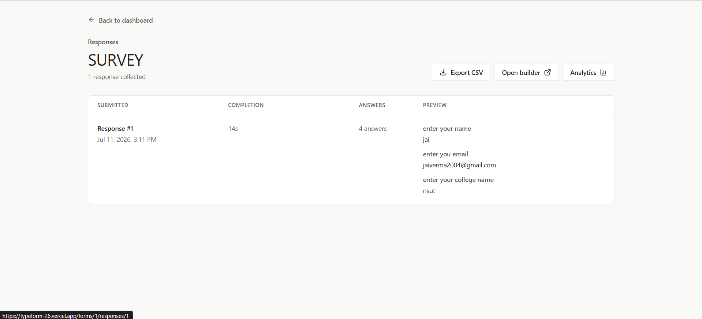
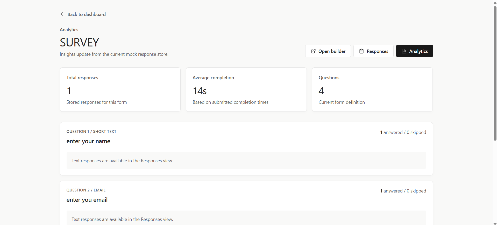

# Formcraft — Typeform Clone

A full-stack Typeform-style form builder with a conversational one-question-at-a-time respondent experience, conditional logic, autosave, analytics, themes, dark mode, file-upload metadata support, and CSV export.

The project is built as a production-style frontend/backend system with a contract-first API, modular architecture, reusable rendering logic, and separate creator/respondent workflows.

> **Status:** Core functionality is complete. The application is deployed and includes the full creator workflow, respondent flow, analytics, conditional logic, and theming.

---

## Live Demo

- Frontend: `https://typeform-26.vercel.app/`
- Backend API: `https://typeform-az8x.onrender.com`
- Swagger Docs: `https://typeform-az8x.onrender.com/docs`

## Repository Structure

```text
typeform-clone/
├── frontend/   # Next.js + TypeScript application
└── backend/    # FastAPI + SQLAlchemy application
```

---

## Features

### Form Management

- Create, rename, duplicate, and delete forms
- Draft and published form states
- Shareable public form URLs
- Search, filter, and sort forms
- Response counts
- Typeform-style creator dashboard

### Form Builder

- Three-panel form builder
- Add, edit, delete, and reorder questions
- Drag-and-drop with DnD Kit
- Debounced autosave
- Live preview
- Publish and unpublish controls
- Save-status feedback
- Responsive desktop, tablet, and mobile layouts

### Supported Question Types

- Short text
- Long text
- Email
- Number
- Multiple choice
- Dropdown
- Yes / No
- Rating
- File upload

### Respondent Experience

- One question displayed at a time
- Keyboard navigation
- Previous, Next, and Finish controls
- Progress tracking
- Client-side validation
- Server-ready submission payloads
- Thank-you screen
- Responsive full-screen experience

### Conditional Logic

- Logic rules based on question answers
- Forward question jumps
- Submit-form actions
- Rule priority ordering
- Operator validation by question type
- Shared logic evaluator for builder preview and public forms
- History-aware Previous navigation

### Draft Autosave

- Partial-response autosave
- Resume or start over
- Restores answers, current question, and navigation history
- Draft deletion after successful submission
- Compatible with future FastAPI persistence endpoints

### Responses

- Per-form response list
- Individual response detail view
- Correct answer-to-question mapping by numeric question ID
- File metadata rendering
- CSV export

### Analytics

- Total responses
- Average completion time
- Answered and skipped counts
- Multiple-choice and dropdown distributions
- Rating average and distribution
- Yes/No counts
- Started and completed response metrics

### Themes and Appearance

- Form theme presets
- Custom colors
- Custom fonts
- Solid and gradient backgrounds
- Button and input radius controls
- Live theme preview
- Dark mode
- System color-scheme fallback
- Persistent appearance preference

---

## Tech Stack

### Frontend

- Next.js
- TypeScript
- Tailwind CSS
- Axios
- Zustand
- React Hook Form
- Zod
- DnD Kit
- Framer Motion
- Sonner
- Recharts
- Lucide React

### Backend

- Python
- FastAPI
- SQLAlchemy
- Pydantic
- SQLite
- Uvicorn

> SQLite is suitable for local development and small demos. On Render, use a persistent disk or migrate to PostgreSQL for reliable production persistence.

---

## Architecture

The frontend communicates with the backend exclusively through a service layer. This abstraction allows the application to switch between mock data and the real FastAPI backend without changing UI components.

The project follows an API-first design:

```text
React Component
      ↓
Feature Hook / Zustand Store
      ↓
Service Layer
      ↓
Mock Adapter or Axios Adapter
      ↓
FastAPI Backend
      ↓
SQLAlchemy
      ↓
Database
```

### Key Decisions

- Components never call Axios directly.
- Components never import mock data directly.
- The mock and real API implementations share the same service interface.
- Backend field names remain in `snake_case`.
- Numeric IDs are used for forms, questions, responses, rules, drafts, and themes.
- Public slugs remain strings.
- Business logic is kept outside visual components.
- The builder preview and respondent flow reuse centralized question rendering and branching logic.

---

## Frontend Routes

```text
/                                           Dashboard
/builder/[formId]                           Form builder
/form/[slug]                                Public respondent form
/forms/[formId]/responses                   Response list
/forms/[formId]/responses/[responseId]      Response detail
/forms/[formId]/analytics                   Analytics
```

---

## Backend API Overview

Base prefix:

```text
/api/v1
```

### Health

```http
GET /api/v1/health
```

### Forms

```http
GET    /api/v1/forms
POST   /api/v1/forms
GET    /api/v1/forms/{form_id}
PATCH  /api/v1/forms/{form_id}
DELETE /api/v1/forms/{form_id}

POST   /api/v1/forms/{form_id}/duplicate
POST   /api/v1/forms/{form_id}/publish
POST   /api/v1/forms/{form_id}/unpublish
```

### Questions

```http
POST   /api/v1/forms/{form_id}/questions
PATCH  /api/v1/questions/{question_id}
DELETE /api/v1/questions/{question_id}
PATCH  /api/v1/forms/{form_id}/questions/reorder
```

### Public Forms

```http
GET  /api/v1/public/forms/{slug}
POST /api/v1/public/forms/{slug}/responses
```

### Responses

```http
GET /api/v1/forms/{form_id}/responses
GET /api/v1/responses/{response_id}
GET /api/v1/forms/{form_id}/responses/export
```

### Analytics

```http
GET /api/v1/forms/{form_id}/analytics
```

### Conditional Logic

```http
GET    /api/v1/forms/{form_id}/logic-rules
POST   /api/v1/forms/{form_id}/logic-rules
PATCH  /api/v1/logic-rules/{rule_id}
DELETE /api/v1/logic-rules/{rule_id}
PATCH  /api/v1/forms/{form_id}/logic-rules/reorder
```

### Drafts

```http
GET    /api/v1/public/{slug}/draft
POST   /api/v1/public/{slug}/draft
PATCH  /api/v1/drafts/{draft_id}
DELETE /api/v1/drafts/{draft_id}
```

### Themes

```http
GET   /api/v1/forms/{form_id}/theme
PATCH /api/v1/forms/{form_id}/theme
POST  /api/v1/forms/{form_id}/theme/reset
```

Some bonus-feature endpoints may depend on the final backend implementation.

All API responses use JSON and follow RESTful resource conventions. Validation errors return HTTP 422 with detailed field-level messages, while unexpected server failures return standardized error responses.

---

## Getting Started

### Prerequisites

Install:

- Node.js 20+
- npm
- Python 3.11+
- Git

---

## Frontend Setup

```bash
cd frontend
npm install
```

Create the local environment file:

```powershell
Copy-Item .env.example .env.local
```

Or on macOS/Linux:

```bash
cp .env.example .env.local
```

Example:

```env
NEXT_PUBLIC_API_URL=http://localhost:8000/api/v1
NEXT_PUBLIC_USE_MOCK_API=false
```

Use:

```env
NEXT_PUBLIC_USE_MOCK_API=true
```

to run the frontend against the built-in mock adapter.

Start the frontend:

```bash
npm run dev
```

Open:

```text
http://localhost:3000
```

### Frontend Commands

```bash
npm run dev
npm run test
npm run typecheck
npm run lint
npm run build
```

---

## Backend Setup

```bash
cd backend
python -m venv .venv
```

Activate the virtual environment.

### Windows PowerShell

```powershell
.venv\Scripts\Activate
```

### macOS/Linux

```bash
source .venv/bin/activate
```

Install dependencies:

```bash
pip install -r requirements.txt
```

Create the environment file:

```powershell
Copy-Item .env.example .env
```

Or:

```bash
cp .env.example .env
```

Example:

```env
APP_NAME=Typeform Clone API
APP_ENV=development
APP_HOST=0.0.0.0
APP_PORT=8000
DATABASE_URL=sqlite+aiosqlite:///./typeform.db
FRONTEND_URL=http://localhost:3000
BACKEND_URL=http://localhost:8000
SECRET_KEY=replace-with-a-secure-value
LOG_LEVEL=INFO
API_V1_PREFIX=/api/v1
```

> **Note:** On first startup, the application automatically creates the SQLite database schema if it does not already exist. No manual migration step is required.

Start the backend:

```bash
python -m uvicorn app.main:app --reload
```

Open:

```text
API: http://localhost:8000
Swagger: http://localhost:8000/docs
```

---

## Sample Data

On first startup, the backend automatically seeds an empty database with example data so the application is immediately usable without manual setup:

- 1 demo creator
- 2 forms (one published, one in draft)
- 8 questions on the published form, covering the full range of supported question types
- 1 default theme applied to the published form
- 1 conditional logic rule
- 5 responses with 39 answers in total

Seeding is idempotent: it runs once against an empty database and is automatically skipped on subsequent startups if data already exists, so restarting the app never creates duplicate records. This is covered by `tests/test_seed.py`, which verifies both the seeded counts and that a second run does not duplicate data.

This means the dashboard, builder, response list, response detail view, and analytics dashboard all have real example data to explore immediately after setup, both locally and on the deployed demo.

---

## Database Schema

Core entities:

```text
Creator
Form
Question
FormResponse
Answer
LogicRule
DraftResponse
FormTheme
```

Main relationships:

```text
Creator 1 ─── * Form
Form    1 ─── * Question
Form    1 ─── * FormResponse
FormResponse 1 ─── * Answer
Form    1 ─── * LogicRule
Form    1 ─── 1 FormTheme
```

Questions and answers are matched by stable numeric IDs, never array position.

---

## CSV Export

Exports include:

```text
Response ID
Submitted At
Completion Time
One column per question
```

The exporter:

- Preserves question order
- Escapes commas, quotes, and multiline values
- Converts Yes/No answers into readable text
- Exports file metadata only
- Excludes incomplete drafts

---

## File Upload Behavior

The current frontend stores file metadata:

```json
{
  "id": 1,
  "name": "resume.pdf",
  "size_bytes": 942313,
  "mime_type": "application/pdf"
}
```

It does not store:

- Binary file data
- Base64 data
- Browser `File` objects in responses
- Fake upload URLs

A production deployment should use a dedicated object-storage service such as Cloudinary, Amazon S3, or an equivalent provider.

---

## Deployment

### Frontend

Recommended:

- Vercel

Set:

```env
NEXT_PUBLIC_API_URL=https://typeform-az8x.onrender.com/api/v1
NEXT_PUBLIC_USE_MOCK_API=false
```

### Backend

Recommended:

- Render

Start command:

```bash
python -m uvicorn app.main:app --host 0.0.0.0 --port $PORT
```

Set the frontend origin:

```env
FRONTEND_URL=https://typeform-26.vercel.app
```

### SQLite on Render

This project uses SQLite for simplicity and local development.

When deploying to Render, SQLite should be stored on a Render Persistent Disk to prevent data loss between deployments.

Example:

```env
DATABASE_URL=sqlite+aiosqlite:////var/data/typeform.db
```

For larger production deployments, PostgreSQL is the recommended database.

## Production Notes

- SQLite is used for local development and demonstration.
- A Render Persistent Disk is recommended when deploying with SQLite.
- PostgreSQL is recommended for production-scale deployments.
- Static assets should be served through a CDN or object storage in production.

---

## Testing

Frontend:

```bash
cd frontend
npm run test
npm run typecheck
npm run lint
npm run build
```

Backend:

```bash
cd backend
pytest
```

Swagger can be used for manual backend testing:

```text
http://localhost:8000/docs
```

---

## Security and Validation

The application includes or is designed for:

- Client-side validation
- Server-side validation
- Strict question-type validation
- Required-answer validation
- Email validation
- Rating bounds
- Choice-option membership checks
- Logic-rule validation
- Numeric identifier validation
- CORS configuration
- Safe CSV escaping

The backend remains the source of truth for all submitted data.

---

## Known Limitations

- SQLite requires persistent storage on Render.
- Real binary upload storage is not included.
- Authentication may use a simplified default creator.
- Logic jumps currently support forward jumps to avoid cycles.
- Branch-aware progress is intentionally approximate.
- Draft persistence depends on the final backend implementation.
- Some optional bonus endpoints may require final synchronization with the backend API contract.

---

## Future Improvements

- PostgreSQL support
- User authentication & authorization
- Team collaboration
- Cloud file storage (Amazon S3 / Cloudinary)
- Webhooks & integrations
- Background jobs
- Rate limiting
- Audit logs
- End-to-end Playwright tests
- CI/CD pipeline
- Observability & structured logging

---

## Screenshots

### Dashboard



### Builder



### Respondent Flow



### Analytics

